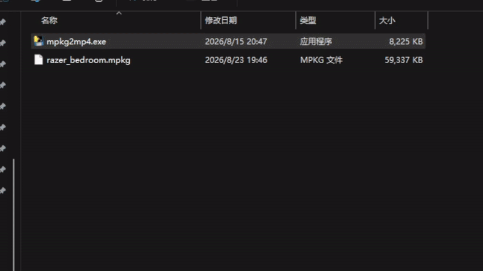
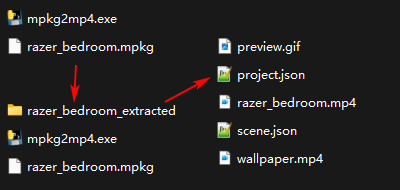
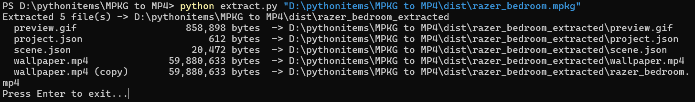

# MPKG to MP4

> **Language:** English | [简体中文](README.md)

Unpacks Wallpaper Engine `.mpkg` archives and directly extracts the `wallpaper.mp4` video file inside.

The source code uses only the Python standard library with no third-party dependencies; users without Python installed can download the portable `mpkg2mp4.exe` from the
[Releases](https://github.com/toki-2004/MPKG-to-MP4/releases) page.



A Wallpaper Engine `.mpkg` archive has the file header `PKGM0014`. It is not a video format,
but a custom container: it holds `wallpaper.mp4` (the video itself),
`project.json` and `scene.json` (wallpaper configuration), and `preview.gif` (the preview image).

Therefore, "converting to mp4" is not transcoding at all — it simply means **extracting the mp4 file from the archive**.



To obtain a wallpaper's mpkg file: right-click the subscribed wallpaper → Send to Mobile Device → Export `.mpkg`, choose pre-rendered, adjust the related settings as you like, and you get the wallpaper's mpkg file.

### Archive format (for reference)

| Field | Length | Description |
| --- | --- | --- |
| Magic number | 8 bytes | `08 00 00 00` + `PKGM0014` |
| File count | 4 bytes | Little-endian uint32; e.g. `04` means 4 files |
| File entries × N | Variable | `name length (4) + name + offset (4) + size (4)`; offsets are relative to the start of the data section |
| Data section | Variable | The data of each file stored consecutively in entry order |

## Usage

### Method 1: Drag and drop (Windows)

1. Double-click `run.bat` to run it (Python must be installed on the machine).

   If Python is not installed, download the portable `mpkg2mp4.exe` from the [Releases](https://github.com/toki-2004/MPKG-to-MP4/releases)
   page: double-clicking the exe opens an interactive window directly — drag the `.mpkg` file into the window
   and press Enter to extract it; you can also drag the `.mpkg` file onto the exe icon, then press Enter to exit once extraction finishes.
2. The window shows an `mpkg path:` input prompt; drag the `.mpkg` file straight into the window and press Enter.
3. After extraction you can keep dragging in the next file; type `exit` and press Enter to quit.
4. The extraction result is written to a `<package_name>_extracted` folder next to the archive.

You can also drag the `.mpkg` file directly onto the `run.bat` icon; it exits automatically after processing one file.

### Method 2: Command line

```bat
python extract.py "D:\path\to\package.mpkg"
```

Here `"D:\path\to\package.mpkg"` is only a **sample path**; replace it with the actual location of your `.mpkg` file.
For example, if the file is located at `D:\pythonitems\3590728775.mpkg`, run:

```bat
python extract.py "D:\pythonitems\3590728775.mpkg"
```

If you do not know the full path, locate the `.mpkg` file in File Explorer, hold Shift and right-click it,
choose "Copy as path", then paste the copied content into the command.

You can also specify an output directory (the last argument is the output location; if omitted, output defaults to next to the archive):

```bat
python extract.py "D:\pythonitems\3590728775.mpkg" "D:\output"
```

After extraction, the output directory contains the original files (`wallpaper.mp4`, `project.json`, `scene.json`,
`preview.gif`) plus an extra `package_name.mp4` copy for direct use.



- Windows: `run.bat` requires Python installed on the machine; the portable `mpkg2mp4.exe` can be downloaded from the
  [Releases](https://github.com/toki-2004/MPKG-to-MP4/releases) page
- Running from source requires Python 3.8+ (standard library only); Windows / macOS / Linux all work

### Building the exe from source (optional)

```bat
pip install pyinstaller
pyinstaller --onefile --console --name mpkg2mp4 extract.py
```

The generated `dist\mpkg2mp4.exe` is the portable version.

## FAQ

**Getting "Not a valid Wallpaper Engine package"?**
The file header is not `PKGM0014`; the archive may be in a format this tool does not support, or the file is corrupted.

**The extracted mp4 is very large?**
4K / 60fps wallpaper videos usually weigh tens of MB — this is normal.
